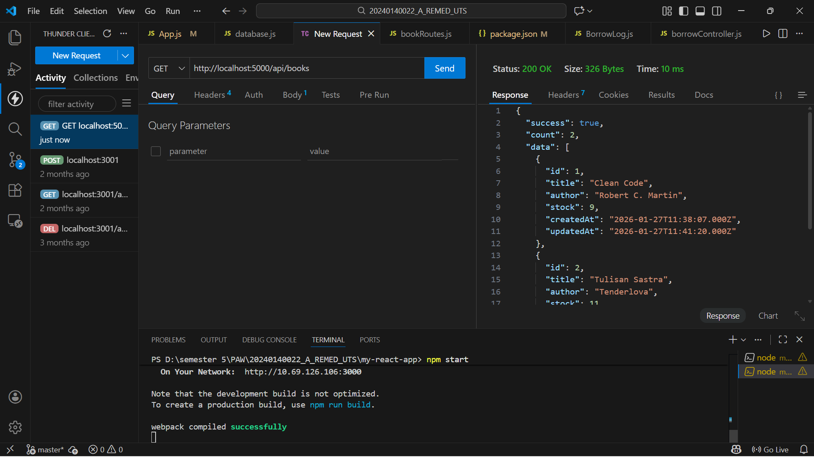
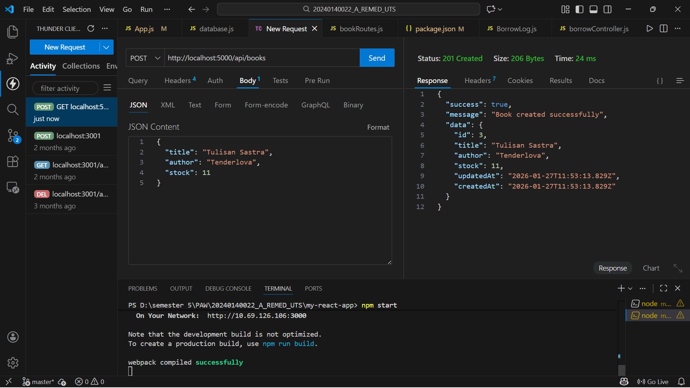
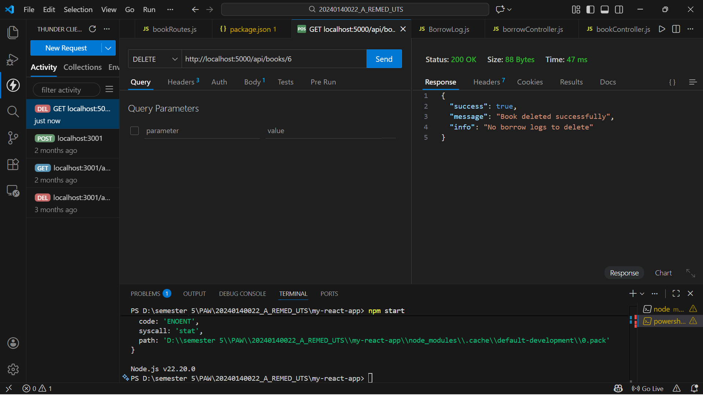
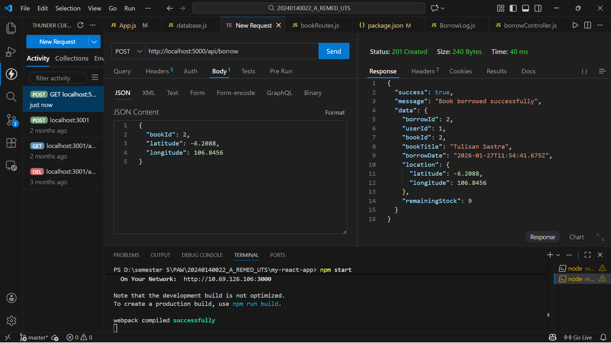
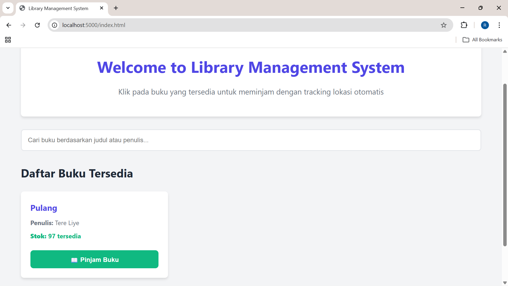
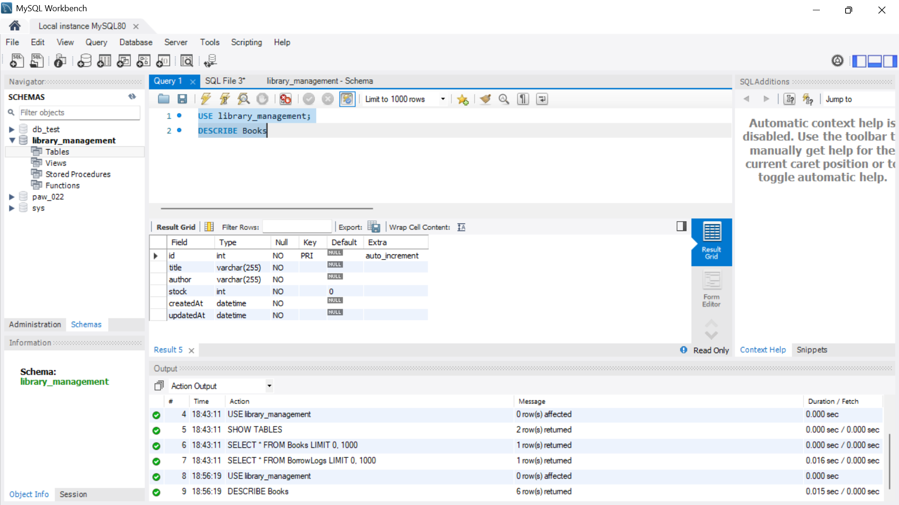
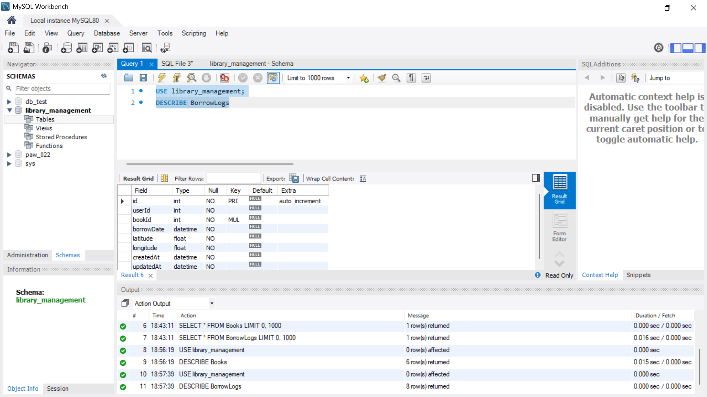
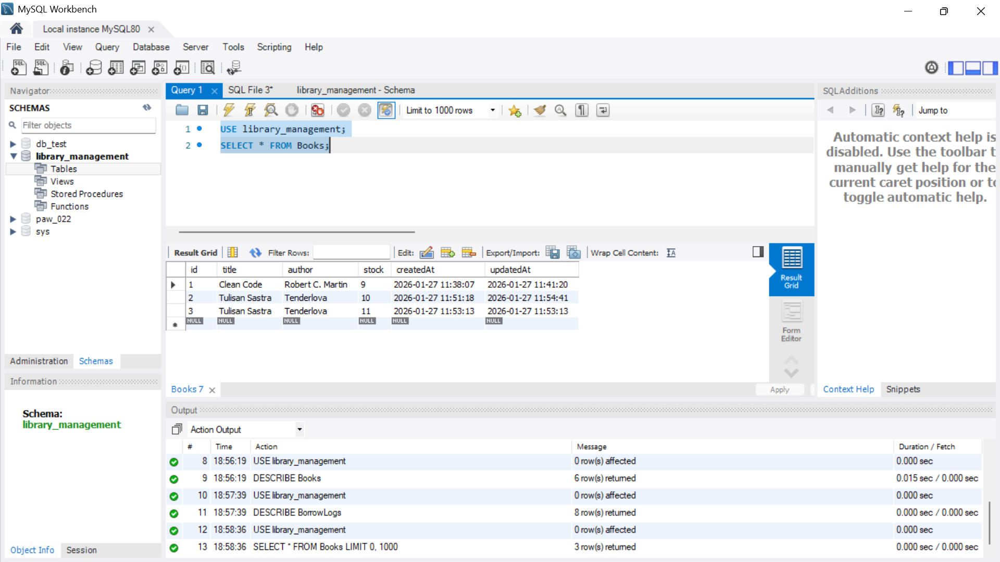
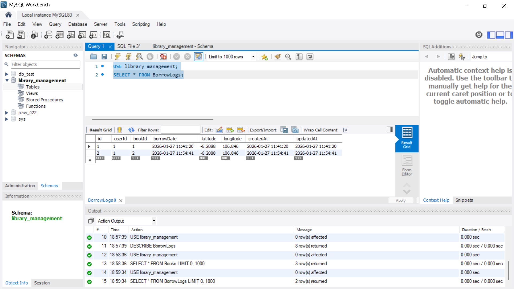

# Library Management System - Location-Based Borrowing

Aplikasi web untuk manajemen perpustakaan dengan fitur tracking lokasi saat meminjam buku.

**Dibuat untuk**: UTS Remedial PAW  
**NIM**: 20240140022

---

## 🚀 Cara Menjalankan Aplikasi

### 1. Install Dependencies

```bash
npm install
```

### 2. Setup Database MySQL

Buka MySQL dan buat database:

```sql
CREATE DATABASE library_management;
```

> **Note**: Tabel akan otomatis dibuat saat server pertama kali jalan

### 3. Konfigurasi Database (Opsional)

Jika perlu ubah kredensial MySQL, edit file `config/database.js`:

```javascript
const sequelize = new Sequelize('library_management', 'root', '', {
  host: 'localhost',
  // ...
});
```

Sesuaikan:
- Database name: `'library_management'`
- Username: `'root'`
- Password: `''` (kosong jika tidak ada password)

### 4. Jalankan Server

```bash
npm start
```

Server akan berjalan di: **http://localhost:5000**

Output yang diharapkan:
```
✓ Database connection established successfully.
✓ Database synchronized successfully.
✓ Server running on http://localhost:5000
✓ API ready to accept requests
```

---

## 📱 Cara Menggunakan Aplikasi

### Home Page (http://localhost:5000)
- Lihat daftar buku yang tersedia
- Cari buku dengan search bar
- **Pinjam buku**: Klik tombol "Pinjam Buku" → Masukkan User ID → Izinkan akses lokasi → Selesai

### Admin Panel (http://localhost:5000/admin.html)
- Tambah buku baru
- Edit informasi buku
- Hapus buku

---

## 📡 API Endpoints

### Public (Tanpa Authentication)

```
GET  /api/books        - Lihat semua buku
GET  /api/books/:id    - Lihat detail buku
```

### Admin Only (Header: x-user-role: admin)

```
POST   /api/books      - Tambah buku baru
PUT    /api/books/:id  - Update buku
DELETE /api/books/:id  - Hapus buku
```

### User Only (Header: x-user-role: user, x-user-id: [id])

```
POST   /api/borrow     - Pinjam buku dengan geolocation
```

**Contoh Request Borrow:**
```json
POST http://localhost:5000/api/borrow

Headers:
  x-user-role: user
  x-user-id: 123
  Content-Type: application/json

Body:
{
  "bookId": 1,
  "latitude": -6.2088,
  "longitude": 106.8456
}
```

---

## 📸 Screenshots

### 1. Test Endpoint API (Thunder Client)

#### GET All Books (Public)

*Response GET /api/books - Menampilkan semua buku yang tersedia*

#### POST Create Book (Admin)

*Response POST /api/books - Admin berhasil menambah buku baru*

#### PUT Update Book (Admin)

*Response PUT /api/books/:id - Admin update stock buku*

#### DELETE Book (Admin)

*Response DELETE /api/books/:id - Hapus buku beserta borrow logs*

#### POST Borrow Book (User dengan Geolocation)

*Response POST /api/borrow - User pinjam buku dengan tracking lokasi*

---

### 2. Tampilan Web Interface

#### Home Page

*Tampilan home page dengan daftar buku dan tombol "Pinjam Buku"*

---

### 3. Struktur Database (MySQL)

#### Tabel Books

*Struktur tabel Books: id, title, author, stock, createdAt, updatedAt*

#### Tabel BorrowLogs (dengan Geolocation)

*Struktur tabel BorrowLogs: id, userId, bookId, borrowDate, latitude, longitude*

---

### 4. Data di Database

#### Data Buku

*Data buku yang tersimpan di tabel Books*

#### Data Peminjaman (dengan Latitude & Longitude)

*Riwayat peminjaman dengan lokasi user (latitude & longitude)*

---

## 🗄️ Database Schema

### Books
```
id          : INTEGER PRIMARY KEY AUTO_INCREMENT
title       : STRING NOT NULL
author      : STRING NOT NULL
stock       : INTEGER NOT NULL DEFAULT 0
createdAt   : DATETIME
updatedAt   : DATETIME
```

### BorrowLogs
```
id          : INTEGER PRIMARY KEY AUTO_INCREMENT
userId      : INTEGER NOT NULL
bookId      : INTEGER FOREIGN KEY → Books(id)
borrowDate  : DATETIME NOT NULL
latitude    : FLOAT NOT NULL
longitude   : FLOAT NOT NULL
createdAt   : DATETIME
updatedAt   : DATETIME
```

---

## 🛠️ Troubleshooting

**Error: Cannot connect to database**
- Pastikan MySQL service running
- Cek database `library_management` sudah dibuat
- Verifikasi username/password di `config/database.js`

**Error: Port 5000 already in use**
- Ganti port di `server.js`: `const PORT = 5001;`

**Error: Cannot find module**
- Jalankan: `npm install`

---

## 📋 Tech Stack

- **Backend**: Node.js, Express.js
- **Database**: MySQL dengan Sequelize ORM
- **Frontend**: Vanilla HTML, CSS, JavaScript
- **Auth**: Simple header-based (x-user-role)

---

## ✨ Fitur

✅ Role-based authentication (admin/user)  
✅ Geolocation tracking saat peminjaman  
✅ CRUD manajemen buku  
✅ Stock management otomatis  
✅ Web interface responsive  

---

**© 2026 - Library Management System**
